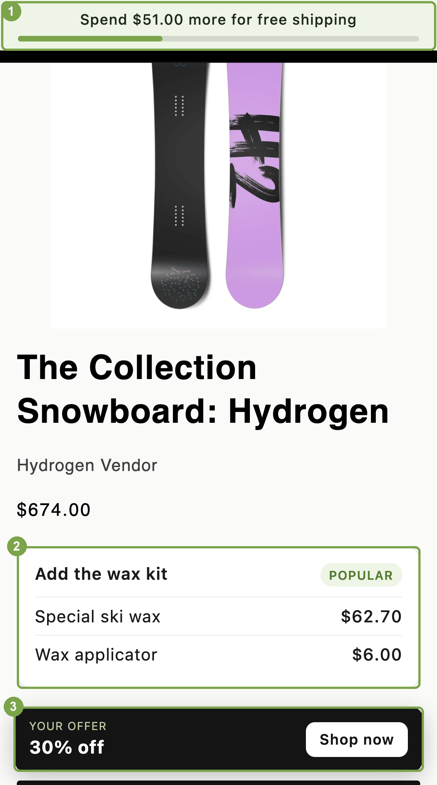

# Browser API examples

Theme JavaScript that reads `window.ABConvert`, the object ABConvert publishes on every storefront page. Each example is one directory, one README, and one script you can add to a theme as it is.

`window.ABConvert` tells your code which test groups the visitor is in, and the price, shipping rates, and offer that visitor gets. It is read-only: to create or manage tests, use the [public API](../public-api/). The contract lives in the [Browser API reference](https://docs.abconvert.io/api-reference/browser-api), and the same examples are walked through on [Browser API examples](https://docs.abconvert.io/api-reference/browser-api-examples). The versions here are the full ones.



Outlined and numbered: **1** the free shipping bar, **2** the bundle card, **3** the offer card. The dimmed parts are the theme's own.

## Start here

| | Example | What you learn |
|---|---|---|
| 1 | [`data-platform`](examples/data-platform/) | Send one event per assignment to a data platform with no built-in integration, once per session. |
| 2 | [`free-shipping-bar`](examples/free-shipping-bar/) | Read the free shipping threshold for the visitor's test group, compare it with the cart, and re-render when the cart changes. |
| 3 | [`custom-price`](examples/custom-price/) | Rewrite price elements ABConvert does not reach, per product variant or per product, and keep them right as the page changes. |
| 4 | [`offer-banner`](examples/offer-banner/) | Render the visitor's offer and how many more items unlock the next volume tier. |

Every example follows the same three habits, which avoid the reference's [common mistakes](https://docs.abconvert.io/api-reference/browser-api#common-mistakes): wait on `window.ABConvertQueue` rather than polling, treat `null` as "leave the theme alone", and compare before you write.

## Try them without a store

The [playground](playground/) runs all four examples against a fake `window.ABConvert` and a fake cart, so you can read the code and see it react. Serve the directory over HTTP and open the page:

```bash
cd browser-api
python3 -m http.server 4190
# then open http://localhost:4190/playground/
```

The page's links use `?abconvert_force=EXPERIMENT_ID:INDEX` to switch between Control and Variant A, the same parameter that works on a real storefront. Edit the fixtures at the top of [`playground/abconvert-mock.js`](playground/abconvert-mock.js) to try other prices, rates, and offers.

The mock is for development only. On a store, the ABConvert app embed publishes the real object; you add only the example script.

## Add an example to a theme

1. Copy the script into your theme's `assets/` folder.
2. Load it from `layout/theme.liquid`, anywhere in `<head>` or before `</body>`:

   ```liquid
   <script src="{{ 'free-shipping-bar.js' | asset_url }}" defer></script>
   ```

3. Add the markup the example's README shows, where you want it rendered.

Order does not matter. Each script pushes its work onto `window.ABConvertQueue`, which runs it once ABConvert is ready, whether the script loaded before or after the app embed.

## Or run one from a visual editor test

You do not have to touch the theme. A [visual editor test](https://docs.abconvert.io/experiments/visual-editor-test#the-right-side-panel) carries custom JavaScript per test group, so the script runs only for visitors in that test group and you end it from the ABConvert admin. Add the code to a test group other than Control, which cannot carry custom code, and build any elements your script renders into inside the `window.ABConvertQueue` callback, because custom JavaScript runs before the page has a `<body>`.

Two differences from a theme script:

- **Add the code to a variant.** The Control group cannot carry custom code.
- **Custom JavaScript runs before the page has a `<body>`.** Create any elements your script renders into inside the `window.ABConvertQueue` callback. The queue runs callbacks in the order you push them, so a callback that builds the markup and is pushed first runs before the example's own:

  ```js
  window.ABConvertQueue = window.ABConvertQueue || [];
  window.ABConvertQueue.push(function () {
    var bar = document.createElement('div');
    bar.className = 'shipping-bar';
    bar.hidden = true;
    document.body.prepend(bar);
  });
  // then the example script, which pushes its own callback
  ```

## QA a test group

Append `?abconvert_force=EXPERIMENT_ID:INDEX` to any storefront URL to see one test group, or run `ABConvert.forceTestGroup('EXPERIMENT_ID', INDEX)` in the console and reload. Forced visits are excluded from results. The [reference](https://docs.abconvert.io/api-reference/browser-api#force-a-test-group) has the details.

## Ask an agent

The reference page is available as plain Markdown at `https://docs.abconvert.io/api-reference/browser-api.md`, so an agent with your theme open can read the contract directly:

> "Read https://docs.abconvert.io/api-reference/browser-api.md. Then add a free shipping progress bar to the cart drawer in this theme that uses the visitor's ABConvert shipping test group."

> "Read https://docs.abconvert.io/api-reference/browser-api.md. Our quick-view modal renders its own price. Make it show the visitor's ABConvert test price, and leave it alone for visitors who are not in a test."
