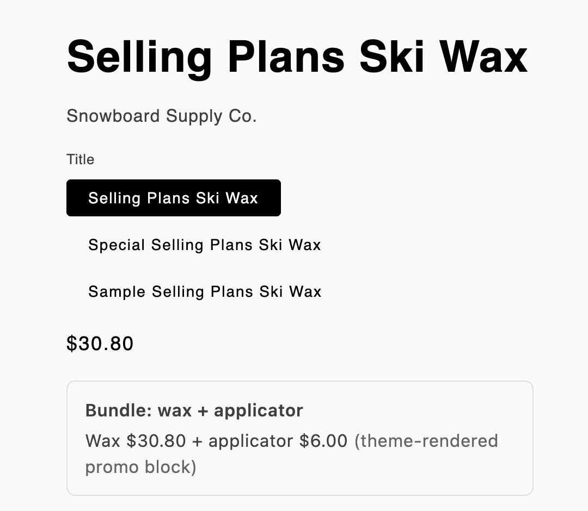

# Custom price element

Show the visitor's test price in an element ABConvert does not rewrite.

Script: [`custom-price.js`](custom-price.js)

ABConvert rewrites the price elements your theme renders on product, collection, and cart pages. A promo block, a bundle builder, a quick-view card, or a collection card you render yourself can fall outside that. This script covers those.



## Markup

Keep the theme's price in the element. It stays for visitors who are not in a test.

One product variant:

```html
<span class="custom-price" data-variant-id="39586780971072">$60.00</span>
```

A product's lowest price, for "From $X" cards:

```html
<span class="custom-price" data-product-id="6654464491584">From $60.00</span>
```

## What it does

1. Asks `getPriceByVariantId()` or `getPriceByProductId()` for every marked element.
2. Renders the price and, when the test sets one, the compare-at price.
3. Leaves the element alone when the answer is `null`.
4. Watches the page with a `MutationObserver` and re-runs once per animation frame, so product variant switches, Ajax collection filters, cart drawers, and lazy-loaded cards get the right price.

## Common mistakes

- **Rendering a price for a visitor who is not in the test.** `null` means no test covers the product variant, the visitor is not in it, or the test sets no price for their country. Leave the theme's price alone.
- **Passing the product ID as the variant ID.** `data-variant-id` takes the product variant ID. For a product-level price, use `data-product-id`.
- **Formatting with the page's default currency.** Pass `price.currency` to `formatPrice`. A price for another country is in that country's currency.
- **Writing a value that is already correct.** The script compares `innerHTML` before writing. Without that check, ABConvert's own page watcher and this script trigger each other until the tab freezes.
