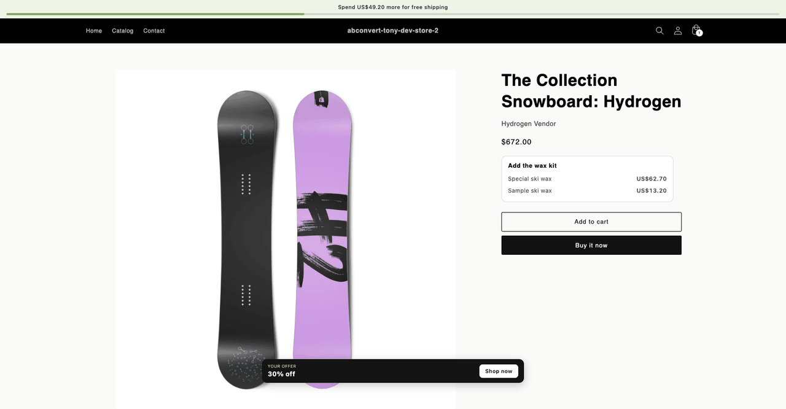

# All three, from a visual editor test

The free shipping bar, a bundle block with test prices, and the offer banner, run from the custom JavaScript of a [visual editor test](https://docs.abconvert.io/experiments/visual-editor-test#the-right-side-panel) instead of the theme. The test runs the script only for visitors in its test group, and you end it from the ABConvert admin.

Script: [`visual-editor-all-three.js`](visual-editor-all-three.js)

## Set it up

1. Create a visual editor test. Put the script in the custom JavaScript of a test group other than Control. Control cannot carry custom code.
2. Set the two product variant IDs at the top of the script to variants a running price test covers, and the fallback prices to their catalog prices.
3. Launch, or preview. To see it yourself, force every test on the page at once with `?abconvert_force=1` on the product URL, after entering the store password if the store has one. The [reference](https://docs.abconvert.io/api-reference/browser-api#force-a-test-group) explains both.

The custom JavaScript field locks when the test launches. To change the script, end the test and create another.

## What differs from a theme script

The example scripts in the other directories assume the theme provides the markup and loads them like any theme script. Injected from a visual editor test, four things change:

1. **The page has no `<body>` yet.** Custom JavaScript is injected into `<head>`. Every element is created inside the first `window.ABConvertQueue` callback, which runs once the document has parsed. Callbacks run in push order, so the builder is pushed before the callbacks that render into it.
2. **The bundle anchors on the product's own price container.** With an item in the cart, Dawn renders the cart drawer's line-item price earlier in the DOM than the product's, inside a drawer that is hidden until opened. Anchoring on the first `.price` on the page puts the block in there, where it exists and is never seen.
3. **The bundle is built on product pages only.** On a collection page the first price belongs to a card.
4. **The offer banner sits above the staff bar** Shopify shows on a password-protected store, so the button is clickable while you preview.

## Common mistakes

- **Checking for the theme's helpers at inject time.** Nothing the theme defines exists yet. Look for `window.subscribe` and friends inside the queue callback.
- **Reading `document.head` before it exists.** It does exist at the visual editor's injection point, but not in every harness. The script falls back to inserting its stylesheet on `DOMContentLoaded`.
- **Judging the bar in the wrong market.** A free shipping threshold is set in one currency. In a market priced in another, the bar says so instead of comparing the two.
