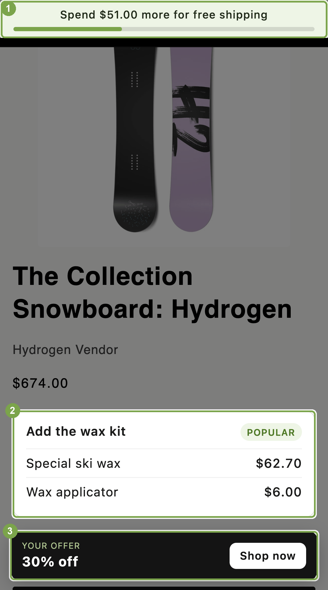

# JavaScript API examples

Use the JavaScript API to send assignments to your analytics tools, and to show a test price, a free shipping bar, or an offer banner on your storefront.

`window.ABConvert` is the object ABConvert puts on every storefront page. It tells your code which test group the visitor is in, and the test price, shipping rates, and offer that test group gets. It is read-only; see the [JavaScript API reference](https://docs.abconvert.io/api-reference/browser-api). The docs walk through shorter versions of these scripts on [JavaScript API examples](https://docs.abconvert.io/api-reference/browser-api-examples). The selectors, IDs, and markup are for the store in the screenshots, so change them to match your theme.



Outlined and numbered: **1** the free shipping bar, **2** the bundle card, **3** the offer card.

## Start here

| | Example | What you learn |
|---|---|---|
| 1 | [`data-platform`](examples/data-platform/) | Send one event per assignment to a data platform with no built-in integration, once per session. |
| 2 | [`free-shipping-bar`](examples/free-shipping-bar/) | Read the free shipping threshold for the visitor's test group, compare it with the cart, and re-render when the cart changes. |
| 3 | [`custom-price`](examples/custom-price/) | Rewrite price elements ABConvert does not reach, per product variant or per product, and keep them right as the page changes. |
| 4 | [`offer-banner`](examples/offer-banner/) | Render the visitor's offer and how many more items unlock the next volume tier. |
| 5 | [`visual-editor`](examples/visual-editor/) | Run the bar, a bundle block, and the banner from a visual editor test's custom JavaScript, with no theme edit. |

Every example follows three habits: wait on `window.ABConvertQueue` rather than polling, treat `null` as "leave the theme alone", and compare before you write.

## Try them without a store

The [playground](playground/) runs the four theme examples against a fake `window.ABConvert` and a fake cart:

```bash
cd javascript-api
python3 -m http.server 4190
# then open http://localhost:4190/playground/
```

Edit the fixtures at the top of [`playground/abconvert-mock.js`](playground/abconvert-mock.js) to try other prices, rates, and offers.

Do not add the mock to a store.

## Add an example to a theme

1. Add the script to your theme's `assets/` folder.
2. Load it from `layout/theme.liquid`, anywhere in `<head>` or before `</body>`:

   ```liquid
   <script src="{{ 'free-shipping-bar.js' | asset_url }}" defer></script>
   ```

3. Add the markup the example's README shows, where you want it rendered, with the selectors and IDs changed to match your theme.

Load order does not matter: each script waits on `window.ABConvertQueue`.

## Or run one from a visual editor test

You do not have to touch the theme. A [visual editor test](https://docs.abconvert.io/experiments/visual-editor-test#the-right-side-panel) carries custom JavaScript per test group, so the script runs only for visitors in that test group and you end it from the ABConvert admin. The [`visual-editor`](examples/visual-editor/) example runs all three components this way.

Two rules differ from a theme script:

- **Add the code to a test group other than Control.** Control cannot carry custom code.
- **Custom JavaScript runs before the page has a `<body>`.** Create any elements your script renders into inside the `window.ABConvertQueue` callback. The queue runs callbacks in the order you push them, so a callback that builds the markup and is pushed first runs before the example's own:

  ```js
  window.ABConvertQueue = window.ABConvertQueue || [];
  window.ABConvertQueue.push(function () {
    var bar = document.createElement('div');
    bar.className = 'shipping-bar';
    bar.hidden = true;
    document.body.prepend(bar);
  });
  // then the example script, which pushes its own callback
  ```

## QA a test group

Append `?abconvert_force=EXPERIMENT_ID:INDEX` to any storefront URL to see one test group, or run `ABConvert.forceTestGroup('EXPERIMENT_ID', INDEX)` in the console and reload. Forced visits are excluded from results. See [See one test group with a link](https://docs.abconvert.io/experiments/lifecycle#see-one-test-group-with-a-link) and [Force a test group](https://docs.abconvert.io/api-reference/browser-api#force-a-test-group).

## Ask an agent

The reference page is available as plain Markdown at `https://docs.abconvert.io/api-reference/browser-api.md`:

> "Read https://docs.abconvert.io/api-reference/browser-api.md. Then add a free shipping progress bar to the cart drawer in this theme that uses the visitor's ABConvert shipping test group."

> "Read https://docs.abconvert.io/api-reference/browser-api.md. Our quick-view modal renders its own price. Make it show the visitor's ABConvert test price, and leave it alone for visitors who are not in a test."
